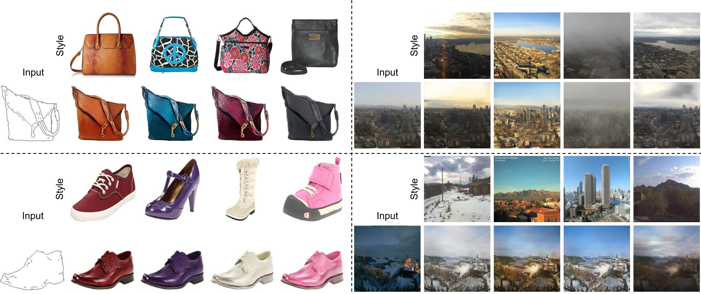

# StEP: Style-based Encoder Pre-training for Multi-modal Image Synthesis
[Moustafa Meshry](http://www.cs.umd.edu/~mmeshry/),
Yixuan Ren,
[Larry S. Davis](http://users.umiacs.umd.edu/~lsd/),
[Abhinav Shrivastava](http://www.cs.umd.edu/~abhinav/).

University of Maryland, College Park

To appear in CVPR 2021. <br><br>


<figure class="image">
  
</figure>

Official Tensorflow 1.15 implementation. The code was original developped in TF 1.13, but is updated to TF 1.15 for release.

[**Paper**](https://arxiv.org/abs/2104.07098) | [**Code**](https://github.com/MoustafaMeshry/StEP) | [**Video**](https://youtu.be/6PFQjIuq8-0) | [**Project page**](http://www.cs.umd.edu/~mmeshry/projects/step/)

### Abstract

We propose a novel approach for multi-modal Image-to-image (I2I) translation. To tackle the one-to-many relationship between input and output domains,
previous works use complex training objectives to learn a latent embedding, jointly with the generator, that models the variability of the output domain.
In contrast, we directly model the style variability of images, independent of the image synthesis task.
Specifically, we pre-train a generic style encoder using a novel proxy task to learn an embedding of images, from arbitrary domains, into a low-dimensional style latent space.
The learned latent space introduces several advantages over previous traditional approaches to multi-modal I2I translation.
First, it is not dependent on the target dataset, and generalizes well across multiple domains.
Second, it learns a more powerful and expressive latent space, which improves the fidelity of style capture and transfer.
The proposed style pre-training also simplifies the training objective and speeds up the training significantly.
Furthermore, we provide a detailed study of the contribution of different loss terms to the task of multi-modal I2I translation, and propose a simple
alternative to VAEs to enable sampling from unconstrained latent spaces.
Finally, we achieve state-of-the-art results on six challenging benchmarks with a simple training objective that includes only a GAN loss and a reconstruction loss.


### Run and train instructions

Our staged-training consists of the following stages:

-   Pre-training the style encoder network (can be done only once on an auxiliary dataset).
-   Training the generator network while freezing the pre-trained style encoder.
-   Fine-tuning both the style encoder and the generator networks.
-   [Optional] Post-train a mapper network to enable random sampling of style codes.

### Dataset preparation


*   Download and extract one of the [datasets](https://people.eecs.berkeley.edu/~tinghuiz/projects/pix2pix/datasets/).

```
dataset_name=edges2shoes
mkdir datasets
cd datasets
wget "https://people.eecs.berkeley.edu/~tinghuiz/projects/pix2pix/datasets/$dataset_name.tar.gz"
tar -zxvf "$dataset_name.tar.gz"
cd ..
```

*   The code assumes the following structure for any given dataset:
    *   `./datasets/$dataset_name/train`
    *   `./datasets/$dataset_name/val`
    *   Each image in the dataset consists of the source and target images concatenated along the width.
*   Download trained weights for the vgg network as instructed in this link: https://github.com/machrisaa/tensorflow-vgg
*   Save the vgg weights to `./third_party/pretrained_weights/vgg16.npy`


### Pre-training the style encoder network

```
style_pretrain_dir="./train_dir/style_pretraining/$dataset_name"
python pretrain_style.py \
  --dataset_name=$dataset_name \
  --pretrain_dir=$style_pretrain_dir \
  --imageset_dir="./datasets/$dataset_name/train" \
  --metadata_output_dir="./train_dir/metadata/$dataset_name"
```

### Training the generator network with a fixed style encoder

```
base_train_dir="./train_dir/$dataset_name/$dataset_name"
fixed_style_train_dir=$base_train_dir-fixed_style
finetune_train_dir=$base_train_dir-finetune
python main.py \
  --dataset_name=$dataset_name \
  --dataset_parent_dir="./datasets/$dataset_name" \
  --train_dir=$fixed_style_train_dir \
  --load_pretrained_app_encoder=true \
  --appearance_pretrain_dir=$style_pretrain_dir \
  --train_app_encoder=false \
  --fixed_lr_kimg=150 \
  --total_kimg=250 \
  --g_nf=32 \
  --d_nf=32 \
  --batch_size=8
```

### Fine-tuning the generator and style encoder


```
python main.py \
  --dataset_name=$dataset_name \
  --dataset_parent_dir="./datasets/$dataset_name" \
  --train_dir=$finetune_train_dir \
  --load_pretrained_app_encoder=false \
  --train_app_encoder=true \
  --load_from_another_ckpt=true \
  --fixed_appearance_train_dir=$fixed_style_train_dir \
  --fixed_lr_kimg=600 \
  --total_kimg=700 \
  --g_nf=32 \
  --d_nf=32 \
  --batch_size=8
```


### Evaluate model on validation set

```
# Run the model on the validation/test set
subset='val'
python main.py \
  --dataset_name=$dataset_name \
  --train_dir=$finetune_train_dir \
  --g_nf=32 \
  --batch_size=8 \
  --subset=$subset \
  --run_mode='eval_subset'

# Evaluate reconstruction metrics (Table 1).
python eval_metrics.py --inference_output_dir=$finetune_train_dir --subset=$subset
```
